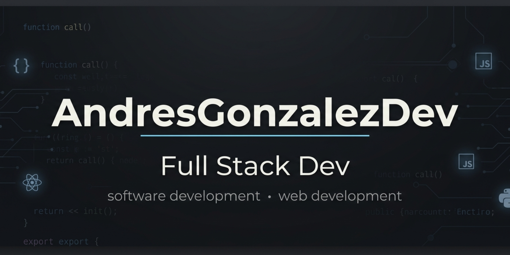

# ¡Hola! Soy Andrés González 👋

  

  

  

  

### 👨‍💻 Sobre mí

 **Desarrollador de Software**, enfocado en convertirme en un **Full Stack Developer** con una sólida base en ciberseguridad y análisis de datos.

Cuento con **más de 2 años de experiencia** en soporte técnico y redes, lo que me permite entender el software desde su infraestructura hasta el código final.

* 🎓 **Estudiando actualmente:** Desarrollo de Software y Ciberseguridad

* 🚀 **Intereses:** Big Data, Ciberseguridad y Desarrollo Web

### 🛠️ Tecnologías y Herramientas

* **Lenguajes:** Python, Java, C++

* **Desarrollo Web:** HTML, CSS, JavaScript, JSP, TailwindCSS

* **Bases de Datos:** MySQL, MongoDB, PostgreSQL

* **Ciberseguridad & Infraestructura:** Kali Linux, AWS Cloud Security, Cisco Networking

### 🏆 Certificaciones Destacadas

* **HCIA-Big Data V.35** - Huawei ICT Academy (2026)

* **AWS Cloud Security** - AWS Academy (2026)

* **Cybersecurity** - Cisco Networking Academy (2025)

### 📫 Contacto

* **LinkedIn:** [Andrés González](https://www.linkedin.com/in/andres-gonzalez444/)

* **Portafolio:** [andresgonzalezdev.netlify.app](https://andresgonzalezdev.netlify.app/)

* **Correo:** [robinsonandresgonzalez2006@gmail.com](mailto:robinsonandresgonzalez2006@gmail.com)

---

### GitHub Stats

*"En constante aprendizaje para resolver problemas complejos a través de la tecnología."*

